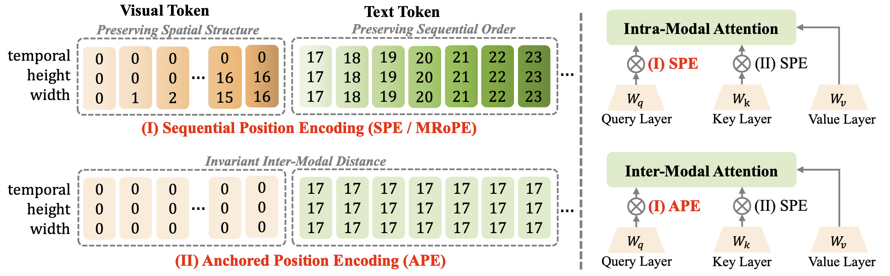
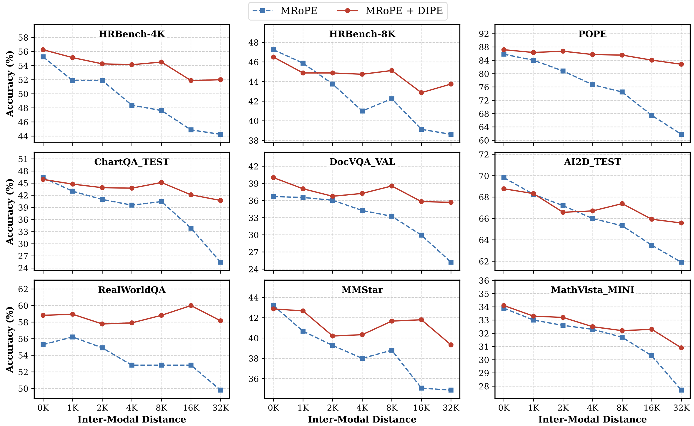

# <div align="center">Beyond Sequential Distance: Inter-Modal Distance Invariant Position Encoding<div>
<div align="center">
  <div>
  <a href="https://arxiv.org/abs/xxx.xxx"></a>&nbsp;&nbsp;
  <a href="[https://arxiv.org/abs/xxx.xxx](https://arxiv.org/abs/xxx.xxxx)"></a>
  </div>
</div>

## 📚Introduction
Despite the remarkable capabilities of Multimodal Large Language Models (MLLMs), they still suffer from visual fading in long-context scenarios. Specifically, the attention to visual tokens diminishes as the text sequence lengthens, leading to text generation detached from visual constraints. We attribute this degradation to the inherent inductive bias of Multimodal RoPE, which penalizes inter-modal attention as the distance between visual and text tokens increases. To address this, we propose inter-modal **D**istance **I**nvariant **P**osition **E**ncoding **(DIPE)**, a simple but effective mechanism that disentangles position encoding based on modality interactions. DIPE retains the natural relative positioning for intra-modal interactions to preserve local structure, while enforcing an anchored perceptual proximity for inter-modal interactions. This strategy effectively mitigates the inter-modal distance-based penalty, ensuring that visual signals remain perceptually consistent regardless of the context length. Experimental results demonstrate that by integrating DIPE with Multimodal RoPE, the model maintains stable visual grounding in long-context scenarios, significantly alleviating visual fading while preserving performance on standard short-context benchmarks.

<div align="center">
  
</div>


## :fire: News

- **`2026/03/10`**: Training and Evaluation Code is available Now! Currently, we only release the implementation with eagar attention for stability.


## :hammer_and_wrench: Install 

-  Create the environment

   ```bash
   conda create -n dipe python=3.12
   conda activate dipe
   ```

- Install PyTorch
   ```bash
   pip install torch==2.7.1 torchvision==0.22.1 torchaudio==2.7.1
   ```

-  Install more requirement
   ```bash
   pip install -r requirements.txt
   ```

-  Please following [LLaVA-Next](https://llava-vl.github.io/blog/2024-01-30-llava-next/) to origin training datasets, and configure it in `DIPE/qwenvl/data/__init__.py`

-  Evaluations are implemented using [VLMEvalKit](https://github.com/open-compass/VLMEvalKit). Please refer to `DIPE/long_context_vqa` for distractor text generation.


## :arrow_forward: Results

<div align="center">
  
</div>


## :hearts: Acknowledgement

We thank [Qwen3-VL](https://github.com/QwenLM/Qwen3-VL/tree/main/qwen-vl-finetune), [Transformers](https://github.com/huggingface/transformers), [LLaVA-Next](https://llava-vl.github.io/blog/2024-01-30-llava-next/) and [VLMEvalKit](https://github.com/open-compass/VLMEvalKit), which we used to build our training and evalution code. 


## :black_nib: Citation

If you find our work helpful for your research, please consider citing the following BibTeX entry. 

```
@article{chen2026dipe,
    title = {Beyond Sequential Distance: Inter-Modal
Distance Invariant Position Encoding},
    author = {Lin Chen and Bolin Ni and Qi Yang and Zili Wang and Kun Ding and Ying Wang and Houwen Peng and Shiming Xiang},
    year = {2026},
}
```